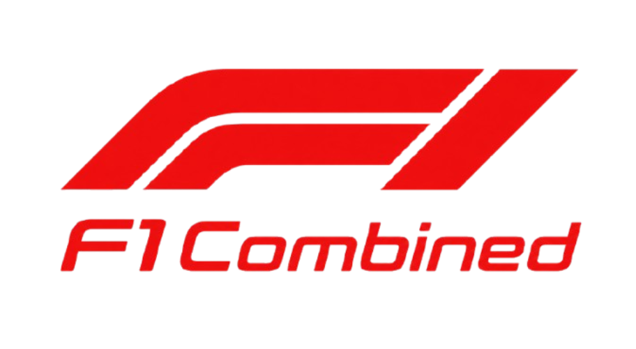

<div align="center">

  

  ### Engineering Analytics & Race Intelligence Platform

  An enterprise-grade Formula 1 analytics workspace delivering post-race intelligence, 2026 World Championship standings, circuit guides, and driver performance comparisons.

  [](https://f1-combined.vercel.app/)
  [](https://nextjs.org/)
  [](https://www.typescriptlang.org/)
  [](https://react.dev/)
  [](https://expressjs.com/)
  [](https://firebase.google.com/)

</div>

---

## Live Deployment

The platform is deployed live on **Vercel** and accessible worldwide:

-  **Live Application**: [https://f1-combined.vercel.app/](https://f1-combined.vercel.app/)

---

## Key Features

-  **2026 World Championships**: Live standings and points breakdowns for the World Drivers' Championship (WDC) and World Constructors' Championship (WCC).
-  **Grand Prix Race Calendar & Session Results**: Schedule and classification results for all 2026 Grand Prix weekends.
-  **24-Driver Grid & Cloud Sync**: Full 2026 driver grid avatar selection synchronized to Firebase Cloud Firestore.
-  **Circuit Intelligence**: Track dimensions, lap records, location maps, and weather conditions for all 2026 calendar circuits.
-  **Performance Comparison Engine**: Interactive side-by-side driver statistics and constructor head-to-head metrics.

---

## Architecture & Tech Stack

```text
F1Combined Monorepo
├── frontend/             # Next.js 16 App Router Frontend (Port 3000)
├── backend/              # Node.js + Express API Backend (Port 3001)
└── packages/shared/      # Shared TypeScript data models and interfaces
```

### Stack Highlights
- **Frontend**: Next.js 16 (Turbopack), React 19, TypeScript, CSS Modules, ECharts, TanStack Query.
- **Backend**: Node.js, Express.js, TypeScript, Nodemon, CORS.
- **Database & Auth**: Firebase Authentication (Google OAuth + Email/Password), Cloud Firestore.

---

## Getting Started

### 1. Prerequisites
- **Node.js**: v18.0.0 or higher
- **npm**: v9.0.0 or higher

### 2. Installation & Setup

```bash
# Clone repository
git clone https://github.com/piyush112007/F1Combined.git
cd F1Combined

# Install workspace dependencies
npm install

# Setup environment
cp frontend/.env.example frontend/.env.local
```

### 3. Running Development Server

```bash
npm run dev
```

- **Frontend**: `http://localhost:3000`
- **Backend API**: `http://localhost:3001`

---

## Production Build

```bash
npm run build
```

---

## License

This repository is licensed under the MIT License.
